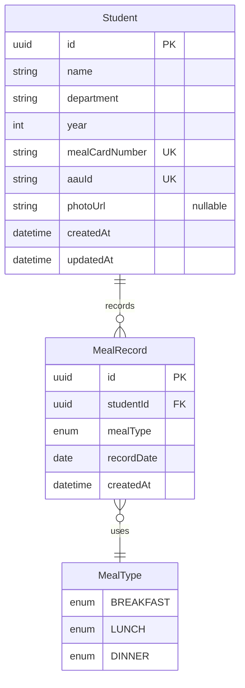

# CTBE Cafe — Entity Relationship Diagram

This document describes the database design for **CTBE Cafe**, a meal registration and reporting system for university students. The schema is defined in `prisma/schema.prisma` and stored in **PostgreSQL**.

---

## ER Diagram (Mermaid)



---

## Visual Overview (ASCII)

```
┌─────────────────────────────────────┐
│              STUDENT                │
├─────────────────────────────────────┤
│ PK  id              (UUID)          │
│     name            (String)        │
│     department      (String)        │
│     year            (Int)           │
│ UK  mealCardNumber  (String)        │
│ UK  aauId           (String)        │
│     photoUrl        (String, null)  │
│     createdAt       (DateTime)      │
│     updatedAt       (DateTime)      │
└─────────────────┬───────────────────┘
                  │
                  │ 1
                  │
                  │ has many
                  │
                  │ *
                  ▼
┌─────────────────────────────────────┐
│            MEAL_RECORD              │
├─────────────────────────────────────┤
│ PK  id              (UUID)          │
│ FK  studentId       → Student.id    │
│     mealType        (MealType)      │
│     recordDate      (Date)          │
│     createdAt       (DateTime)      │
├─────────────────────────────────────┤
│ UK  (studentId, mealType, recordDate)│
└─────────────────────────────────────┘

         MealType (enum)
         ───────────────
         • BREAKFAST
         • LUNCH
         • DINNER
```

---

## Entities

### 1. Student

Represents a registered university student who can receive meals at the cafe.

| Attribute        | Type     | Key | Nullable | Description                                      |
|------------------|----------|-----|----------|--------------------------------------------------|
| `id`             | UUID     | PK  | No       | Unique identifier (auto-generated)               |
| `name`           | String   |     | No       | Student full name                                |
| `department`     | String   |     | No       | Academic department (e.g. Software Engineering)  |
| `year`           | Int      |     | No       | Academic year (1–8)                              |
| `mealCardNumber` | String   | UK  | No       | 4-digit meal card number (unique per student)    |
| `aauId`          | String   | UK  | No       | AAU student ID, format `UGR-####-##` (unique)    |
| `photoUrl`       | String   |     | Yes      | Student photo stored as base64 data URL          |
| `createdAt`      | DateTime |     | No       | When the student was registered                  |
| `updatedAt`      | DateTime |     | No       | When the student record was last modified        |

**Valid departments** (enforced in application code, not as a database enum):

- Mechanical Engineering
- Civil Engineering
- Electrical Engineering
- Software Engineering
- Biomedical Engineering

---

### 2. MealRecord

Represents a single meal served to a student on a specific date.

| Attribute    | Type     | Key | Nullable | Description                                |
|--------------|----------|-----|----------|--------------------------------------------|
| `id`         | UUID     | PK  | No       | Unique identifier (auto-generated)         |
| `studentId`  | UUID     | FK  | No       | References `Student.id`                    |
| `mealType`   | MealType |     | No       | Type of meal: BREAKFAST, LUNCH, or DINNER  |
| `recordDate` | Date     |     | No       | Calendar date the meal was recorded        |
| `createdAt`  | DateTime |     | No       | Timestamp when the record was created      |

---

### 3. MealType (Enum)

Not a separate table — stored as a PostgreSQL enum on `MealRecord.mealType`.

| Value       | Meaning  |
|-------------|----------|
| `BREAKFAST` | Breakfast |
| `LUNCH`     | Lunch     |
| `DINNER`    | Dinner    |

---

## Relationships

| From          | To          | Cardinality   | Description                                      |
|---------------|-------------|---------------|--------------------------------------------------|
| **Student**   | **MealRecord** | **1 : N** (one-to-many) | One student can have many meal records over time |
| **MealRecord** | **Student** | **N : 1** (many-to-one) | Each meal record belongs to exactly one student  |

**Foreign key:** `MealRecord.studentId` → `Student.id`

**Delete behavior:** Default PostgreSQL `RESTRICT` — a student cannot be deleted while meal records still reference them.

---

## Constraints & Business Rules

| Constraint | Type | Purpose |
|------------|------|---------|
| `Student.mealCardNumber` UNIQUE | Unique key | No two students can share the same meal card |
| `Student.aauId` UNIQUE | Unique key | No two students can share the same AAU ID |
| `(studentId, mealType, recordDate)` UNIQUE | Composite unique | A student can receive **at most one meal of each type per day** (e.g. only one lunch on 2026-06-10) |

---

## Example Data Flow

1. A **Student** is registered with name, department, year, meal card, and AAU ID.
2. At the ticking station, staff scan the meal card and create a **MealRecord** linked to that student.
3. The system records which **MealType** was served and the **recordDate**.
4. Reports aggregate `MealRecord` rows by date and meal type for daily statistics.

---

## Source

Schema definition: [`prisma/schema.prisma`](../prisma/schema.prisma)

Database: **PostgreSQL** via **Prisma ORM**
